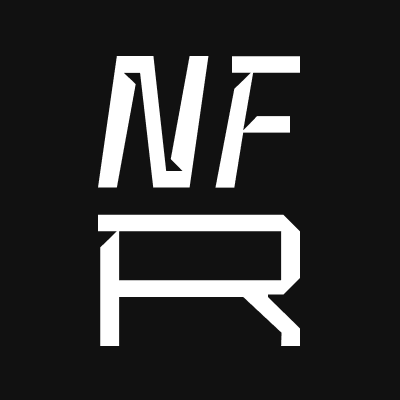

</table>

# NFR Engine
*NFR Engine* is a framework that makes it easy to recreate old racing games from scratch and modify them with the modern technoligies.\
This code contains only **engine** and don't provide game code for games itself.\
If you want to see game sources, try to look at "plugins folder" inside this github repository.

# Building the project

This project was created using the CMake project generation system. 

To build the Visual Studio solution or other projects use cmdline:
```sh
mkdir build
cd build 
cmake .. # add your custom arguments here
```

# Legal
**This project is licensed under LGPL v2.1**
